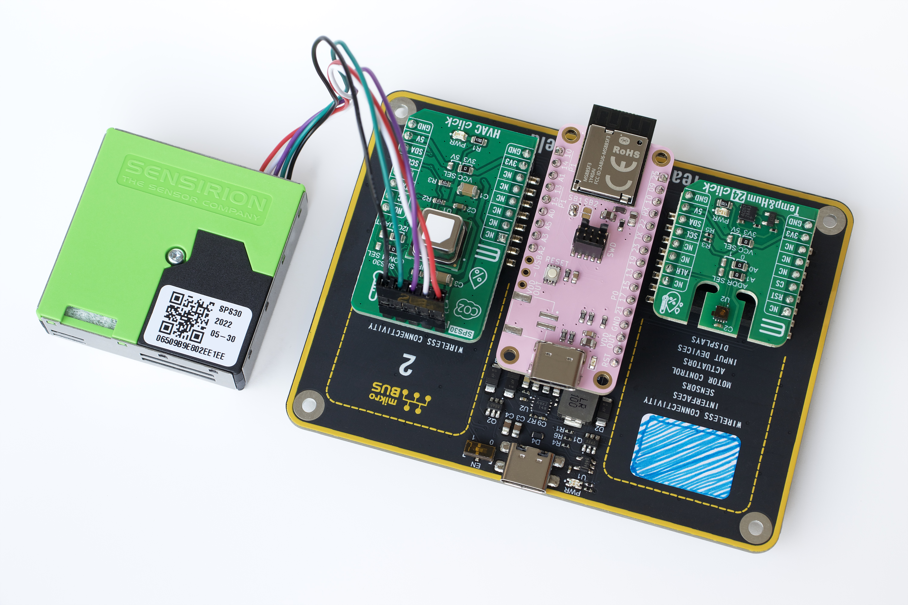
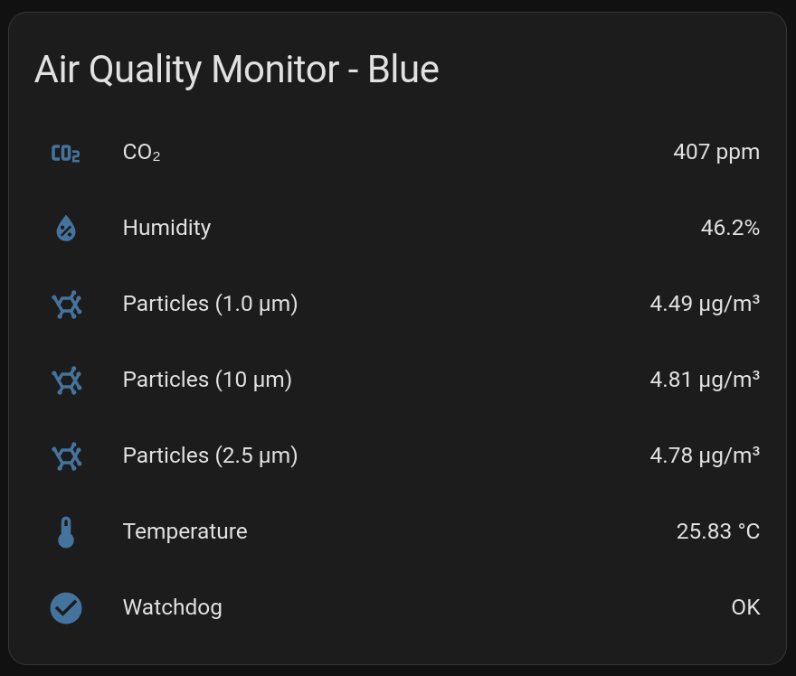
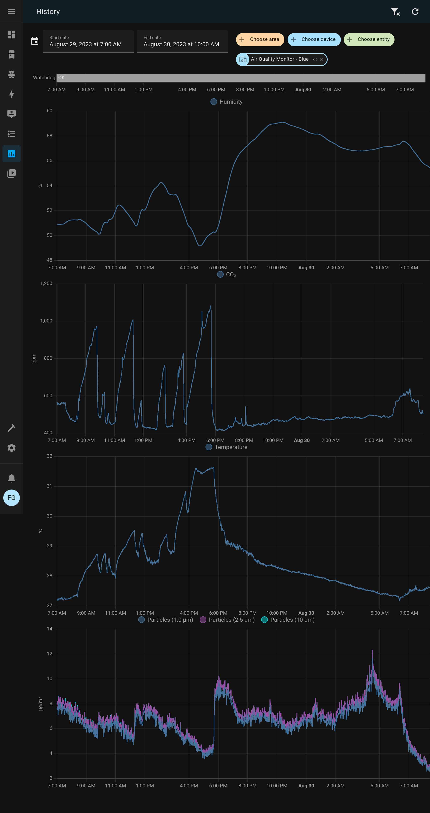

# Air Quality Station



## Home Assistant Card

This view is created automatically from the information published by the sensor
through the MQTT discovery protocol.



### History



## Boot Logs

```
*** Booting Zephyr OS build v3.3.99-ncs1 ***
[00:00:00.113,861] <inf> init: main watchdog channel id: 0
[00:00:00.113,891] <inf> init: mqtt watchdog channel id: 1
[00:00:00.113,891] <inf> init: 🐶 watchdog started!
[00:00:00.113,922] <inf> main: 

                               🚀 MAIN START (v0.4.0-39-g686d192) 🚀

[00:00:00.113,952] <inf> reset: ✨ reset cause: software
[00:00:00.114,013] <inf> net_l2_openthread: OpenThread version: OPENTHREAD/d9abe3071; Zephyr; Aug 27 2023 13:04:09
[00:00:00.115,722] <inf> net_l2_openthread: Network name: home
[00:00:00.142,242] <inf> net_l2_openthread: State changed! Flags: 0x0100103d Current role: detached
[00:00:00.142,608] <inf> openthread: state: 0x0100103d has_neighbours:no route_available:no
[00:00:00.142,608] <inf> openthread: No role set
[00:00:00.160,247] <inf> net_l2_openthread: State changed! Flags: 0x00000084 Current role: child
[00:00:00.160,400] <inf> openthread: Neighbor addr:2efe7e806e8ad225 age:0
[00:00:00.160,491] <inf> openthread: state: 0x00000084 has_neighbours:yes route_available:no
[00:00:00.160,491] <inf> openthread: Child role set
[00:00:00.194,091] <inf> net_l2_openthread: State changed! Flags: 0x00000200 Current role: child
[00:00:00.194,244] <inf> openthread: Neighbor addr:2efe7e806e8ad225 age:0
[00:00:00.194,580] <inf> openthread: Route prefix:fd042240000001020000000000000000 default:no preferred:yes
[00:00:00.194,671] <inf> openthread: state: 0x00000200 has_neighbours:yes route_available:yes
[00:00:00.194,732] <inf> net_l2_openthread: State changed! Flags: 0x00000001 Current role: child
[00:00:00.194,946] <inf> openthread: Neighbor addr:2efe7e806e8ad225 age:0
[00:00:00.195,281] <inf> openthread: Route prefix:fd042240000001020000000000000000 default:no preferred:yes
[00:00:00.195,343] <inf> openthread: state: 0x00000001 has_neighbours:yes route_available:yes
[00:00:00.195,373] <inf> openthread: �  openthread ready!
[00:00:00.674,011] <inf> uid: CPU device id: 133c2c382d9111f1
[00:00:00.676,513] <inf> uid: HDC302x serial number: 5f36817c0b16
[00:00:00.677,947] <inf> uid: SCD4x serial number: e05e2f073b4d
[00:00:00.682,891] <inf> uid: SPS30 serial number: 06509B9E802EE1EE
[00:00:00.682,983] <inf> uid: 📇 unique id: nrf52840_133c2c382d9111f1_wdt
[00:00:00.683,074] <inf> uid: 📇 unique id: hdc302x_5f36817c0b16_temp
[00:00:00.683,135] <inf> uid: 📇 unique id: hdc302x_5f36817c0b16_hum
[00:00:00.683,227] <inf> uid: 📇 unique id: scd4x_e05e2f073b4d_co2
[00:00:00.683,319] <inf> uid: 📇 unique id: sps30_06509B9E802EE1EE_pm1
[00:00:00.683,380] <inf> uid: 📇 unique id: sps30_06509B9E802EE1EE_pm25
[00:00:00.683,471] <inf> uid: 📇 unique id: sps30_06509B9E802EE1EE_pm10
[00:00:00.683,502] <inf> main: 💤 waiting for openthread to be ready
[00:00:00.683,593] <inf> home_assistant: 📝 registering sensor: nrf52840_133c2c382d9111f1_wdt
[00:00:00.683,685] <inf> home_assistant: 📖 send discovery
[00:00:00.683,776] <dbg> home_assistant: ha_send_discovery: discovery topic: homeassistant/binary_sensor/nrf52840_133c2c382d9111f1_wdt/config
[00:00:00.684,661] <dbg> home_assistant: ha_send_discovery: payload: {"~":"air_quality/133c2c382d9111f1","name":"Watchdog","unique_id":"nrf52840_133c2c3
82d9111f1_wdt","object_id":"nrf52840_133c2c382d9111f1_wdt","device_class":"problem","availability_topic":"~/available","state_topic":"~/binary_sensor/nr
f52840_133c2c382d9111f1_wdt/state","dev":{"identifiers":"133c2c382d9111f1","name":"Air Quality Monitor - Blue","sw_version":"v0.4.0-39-g686d192","hw_ver
sion":"rev1","model":"Gold","manufacturer":"François Gervais"}}
[00:00:00.684,692] <inf> mqtt: 📤 homeassistant/binary_sensor/nrf52840_133c2c382d9111f1_wdt/config
[00:00:00.684,814] <inf> mqtt:    └── payload: {"~":"air_quality/133c2c382d9111f1","name":"Watchdog","unique_id":"nrf52840_133c2c382d9111f1_wdt","obje
ct_id":"nrf52840_133c2c382d9111f1_wdt","device_class":"problem","availability_topic":"~/available","state_topic":"~/binary_sensor/nrf52840_133c2c382d911
1f1_wdt/state","dev":{"identifiers":"133c2c382d9111f1","name":"Air Quality Monitor - Blue","sw_version":"v0.4.0-39-g686d192","hw_version":"rev1","model"
:"Gold","manufacturer":"François Gervais"}}
[00:00:00.684,875] <inf> mqtt: 🔌 connect to server
[00:00:00.684,875] <inf> mqtt: resolving server address
[00:00:00.703,796] <inf> mqtt: DNS resolved for home.home.arpa:1883
[00:00:00.703,826] <inf> mqtt: └── address: fd04:2240::10
[00:00:00.703,857] <inf> mqtt: attempting to connect
[00:00:00.703,918] <dbg> mqtt: client_init: client id: 133c2c382d9111f1
[00:00:00.721,221] <inf> net_mqtt: Connect completed
[00:00:00.767,364] <dbg> mqtt: mqtt_event_handler: MQTT client connected!
[00:00:00.767,395] <inf> mqtt: mqtt keepalive: 60s
[00:00:00.768,554] <inf> home_assistant: 📝 registering sensor: hdc302x_5f36817c0b16_temp
[00:00:00.768,615] <inf> home_assistant: 📖 send discovery
[00:00:00.768,707] <dbg> home_assistant: ha_send_discovery: discovery topic: homeassistant/sensor/hdc302x_5f36817c0b16_temp/config
[00:00:00.769,805] <dbg> home_assistant: ha_send_discovery: payload: {"~":"air_quality/133c2c382d9111f1","name":"Temperature","unique_id":"hdc302x_5f368
17c0b16_temp","object_id":"hdc302x_5f36817c0b16_temp","device_class":"temperature","state_class":"measurement","unit_of_measurement":"°C","suggested_dis
play_precision":2,"availability_topic":"~/available","state_topic":"~/sensor/hdc302x_5f36817c0b16_temp/state","dev":{"identifiers":"133c2c382d9111f1","n
ame":"Air Quality Monitor - Blue","sw_version":"v0.4.0-39-g686d192","hw_version":"rev1","model":"Gold","manufacturer":"François Gervais"}}
[00:00:00.769,866] <inf> mqtt: 📤 homeassistant/sensor/hdc302x_5f36817c0b16_temp/config
[00:00:00.769,989] <inf> mqtt:    └── payload: {"~":"air_quality/133c2c382d9111f1","name":"Temperature","unique_id":"hdc302x_5f36817c0b16_temp","object_
id":"hdc302x_5f36817c0b16_temp","device_class":"temperature","state_class":"measurement","unit_of_measurement":"°C","suggested_display_precision":2,"ava
ilability_topic":"~/available","state_topic":"~/sensor/hdc302x_5f36817c0b16_temp/state","dev":{"identifiers":"133c2c382d9111f1","name":"Air Quality Moni
tor - Blue","sw_version":"v0.4.0-39-g686d192","hw_version":"rev1","model":"Gold","manufacturer":"François Gervais"}}
[00:00:00.771,240] <inf> home_assistant: 📝 registering sensor: hdc302x_5f36817c0b16_hum
[00:00:00.771,331] <inf> home_assistant: 📖 send discovery
[00:00:00.771,423] <dbg> home_assistant: ha_send_discovery: discovery topic: homeassistant/sensor/hdc302x_5f36817c0b16_hum/config
[00:00:00.772,796] <dbg> home_assistant: ha_send_discovery: payload: {"~":"air_quality/133c2c382d9111f1","name":"Humidity","unique_id":"hdc302x_5f36817c
0b16_hum","object_id":"hdc302x_5f36817c0b16_hum","device_class":"humidity","state_class":"measurement","unit_of_measurement":"%","suggested_display_prec
ision":1,"availability_topic":"~/available","state_topic":"~/sensor/hdc302x_5f36817c0b16_hum/state","dev":{"identifiers":"133c2c382d9111f1","name":"Air 
Quality Monitor - Blue","sw_version":"v0.4.0-39-g686d192","hw_version":"rev1","model":"Gold","manufacturer":"François Gervais"}}
[00:00:00.772,827] <inf> mqtt: 📤 homeassistant/sensor/hdc302x_5f36817c0b16_hum/config
[00:00:00.772,949] <inf> mqtt:    └── payload: {"~":"air_quality/133c2c382d9111f1","name":"Humidity","unique_id":"hdc302x_5f36817c0b16_hum","object_id":
"hdc302x_5f36817c0b16_hum","device_class":"humidity","state_class":"measurement","unit_of_measurement":"%","suggested_display_precision":1,"availability
_topic":"~/available","state_topic":"~/sensor/hdc302x_5f36817c0b16_hum/state","dev":{"identifiers":"133c2c382d9111f1","name":"Air Quality Monitor - Blue
","sw_version":"v0.4.0-39-g686d192","hw_version":"rev1","model":"Gold","manufacturer":"François Gervais"}}
[00:00:00.773,498] <inf> home_assistant: 📝 registering sensor: scd4x_e05e2f073b4d_co2
[00:00:00.773,590] <inf> home_assistant: 📖 send discovery
[00:00:00.773,681] <dbg> home_assistant: ha_send_discovery: discovery topic: homeassistant/sensor/scd4x_e05e2f073b4d_co2/config
[00:00:00.774,749] <dbg> home_assistant: ha_send_discovery: payload: {"~":"air_quality/133c2c382d9111f1","name":"CO₂","unique_id":"scd4x_e05e2f073b4d_
co2","object_id":"scd4x_e05e2f073b4d_co2","device_class":"carbon_dioxide","state_class":"measurement","unit_of_measurement":"ppm","suggested_display_pre
cision":0,"availability_topic":"~/available","state_topic":"~/sensor/scd4x_e05e2f073b4d_co2/state","dev":{"identifiers":"133c2c382d9111f1","name":"Air Q
uality Monitor - Blue","sw_version":"v0.4.0-39-g686d192","hw_version":"rev1","model":"Gold","manufacturer":"François Gervais"}}
[00:00:00.774,780] <inf> mqtt: 📤 homeassistant/sensor/scd4x_e05e2f073b4d_co2/config
[00:00:00.774,902] <inf> mqtt:    └── payload: {"~":"air_quality/133c2c382d9111f1","name":"CO₂","unique_id":"scd4x_e05e2f073b4d_co2","object_id":"scd4x_
e05e2f073b4d_co2","device_class":"carbon_dioxide","state_class":"measurement","unit_of_measurement":"ppm","suggested_display_precision":0,"availability_
topic":"~/available","state_topic":"~/sensor/scd4x_e05e2f073b4d_co2/state","dev":{"identifiers":"133c2c382d9111f1","name":"Air Quality Monitor - Blue","
sw_version":"v0.4.0-39-g686d192","hw_version":"rev1","model":"Gold","manufacturer":"François Gervais"}}
[00:00:00.777,770] <inf> home_assistant: 📝 registering sensor: sps30_06509B9E802EE1EE_pm1
[00:00:00.777,862] <inf> home_assistant: 📖 send discovery
[00:00:00.777,923] <dbg> home_assistant: ha_send_discovery: discovery topic: homeassistant/sensor/sps30_06509B9E802EE1EE_pm1/config
[00:00:00.778,991] <dbg> home_assistant: ha_send_discovery: payload: {"~":"air_quality/133c2c382d9111f1","name":"Particles (1.0 µm)","unique_id":"sps30_
06509B9E802EE1EE_pm1","object_id":"sps30_06509B9E802EE1EE_pm1","device_class":"pm1","state_class":"measurement","unit_of_measurement":"µg/m³","suggested
_display_precision":2,"availability_topic":"~/available","state_topic":"~/sensor/sps30_06509B9E802EE1EE_pm1/state","dev":{"identifiers":"133c2c382d9111f
1","name":"Air Quality Monitor - Blue","sw_version":"v0.4.0-39-g686d192","hw_version":"rev1","model":"Gold","manufacturer":"François Gervais"}}
[00:00:00.779,022] <inf> mqtt: 📤 homeassistant/sensor/sps30_06509B9E802EE1EE_pm1/config
[00:00:00.779,144] <inf> mqtt:    └── payload: {"~":"air_quality/133c2c382d9111f1","name":"Particles (1.0 µm)","unique_id":"sps30_06509B9E802EE1EE_pm1
","object_id":"sps30_06509B9E802EE1EE_pm1","device_class":"pm1","state_class":"measurement","unit_of_measurement":"µg/m³","suggested_display_precision":
2,"availability_topic":"~/available","state_topic":"~/sensor/sps30_06509B9E802EE1EE_pm1/state","dev":{"identifiers":"133c2c382d9111f1","name":"Air Quali
ty Monitor - Blue","sw_version":"v0.4.0-39-g686d192","hw_version":"rev1","model":"Gold","manufacturer":"François Gervais"}}
[00:00:00.779,693] <inf> home_assistant: 📝 registering sensor: sps30_06509B9E802EE1EE_pm25
[00:00:00.779,785] <inf> home_assistant: 📖 send discovery
[00:00:00.779,876] <dbg> home_assistant: ha_send_discovery: discovery topic: homeassistant/sensor/sps30_06509B9E802EE1EE_pm25/config
[00:00:00.780,914] <dbg> home_assistant: ha_send_discovery: payload: {"~":"air_quality/133c2c382d9111f1","name":"Particles (2.5 µm)","unique_id":"sps30_
06509B9E802EE1EE_pm25","object_id":"sps30_06509B9E802EE1EE_pm25","device_class":"pm25","state_class":"measurement","unit_of_measurement":"µg/m³","sugges
ted_display_precision":2,"availability_topic":"~/available","state_topic":"~/sensor/sps30_06509B9E802EE1EE_pm25/state","dev":{"identifiers":"133c2c382d9
111f1","name":"Air Quality Monitor - Blue","sw_version":"v0.4.0-39-g686d192","hw_version":"rev1","model":"Gold","manufacturer":"François Gervais"}}
[00:00:00.781,005] <inf> mqtt: 📤 homeassistant/sensor/sps30_06509B9E802EE1EE_pm25/config
[00:00:00.781,127] <inf> mqtt:    └── payload: {"~":"air_quality/133c2c382d9111f1","name":"Particles (2.5 µm)","unique_id":"sps30_06509B9E802EE1EE_pm2
5","object_id":"sps30_06509B9E802EE1EE_pm25","device_class":"pm25","state_class":"measurement","unit_of_measurement":"µg/m³","suggested_display_precisio
n":2,"availability_topic":"~/available","state_topic":"~/sensor/sps30_06509B9E802EE1EE_pm25/state","dev":{"identifiers":"133c2c382d9111f1","name":"Air Q
uality Monitor - Blue","sw_version":"v0.4.0-39-g686d192","hw_version":"rev1","model":"Gold","manufacturer":"François Gervais"}}
[00:00:00.892,303] <inf> home_assistant: 📝 registering sensor: sps30_06509B9E802EE1EE_pm10
[00:00:00.892,395] <inf> home_assistant: 📖 send discovery
[00:00:00.892,486] <dbg> home_assistant: ha_send_discovery: discovery topic: homeassistant/sensor/sps30_06509B9E802EE1EE_pm10/config
[00:00:00.893,524] <dbg> home_assistant: ha_send_discovery: payload: {"~":"air_quality/133c2c382d9111f1","name":"Particles (10 µm)","unique_id":"sps30_0
6509B9E802EE1EE_pm10","object_id":"sps30_06509B9E802EE1EE_pm10","device_class":"pm10","state_class":"measurement","unit_of_measurement":"µg/m³","suggest
ed_display_precision":2,"availability_topic":"~/available","state_topic":"~/sensor/sps30_06509B9E802EE1EE_pm10/state","dev":{"identifiers":"133c2c382d91
11f1","name":"Air Quality Monitor - Blue","sw_version":"v0.4.0-39-g686d192","hw_version":"rev1","model":"Gold","manufacturer":"François Gervais"}}
[00:00:00.893,585] <inf> mqtt: 📤 homeassistant/sensor/sps30_06509B9E802EE1EE_pm10/config
[00:00:00.893,707] <inf> mqtt:    └── payload: {"~":"air_quality/133c2c382d9111f1","name":"Particles (10 µm)","unique_id":"sps30_06509B9E802EE1EE_pm10"
,"object_id":"sps30_06509B9E802EE1EE_pm10","device_class":"pm10","state_class":"measurement","unit_of_measurement":"µg/m³","suggested_display_precision"
:2,"availability_topic":"~/available","state_topic":"~/sensor/sps30_06509B9E802EE1EE_pm10/state","dev":{"identifiers":"133c2c382d9111f1","name":"Air Qua
lity Monitor - Blue","sw_version":"v0.4.0-39-g686d192","hw_version":"rev1","model":"Gold","manufacturer":"François Gervais"}}
[00:00:01.958,374] <inf> main: 💤 waiting for all sensors to be ready
[00:00:11.958,496] <inf> mqtt: 📤 air_quality/133c2c382d9111f1/available
[00:00:11.958,557] <inf> mqtt:    └── payload: online
[00:00:11.959,747] <inf> mqtt: 📤 air_quality/133c2c382d9111f1/binary_sensor/nrf52840_133c2c382d9111f1_wdt/state
[00:00:11.959,777] <inf> mqtt:    └── payload: OFF
[00:00:11.960,144] <inf> main: 🎉 init done 🎉
[00:00:11.961,212] <inf> main: HDC302x
[00:00:11.961,242] <inf> main: ├── Temperature: 25.78°C
[00:00:11.961,242] <inf> main: └── Humidity: 46.4%
[00:00:11.963,378] <inf> main: SCD4x
[00:00:11.963,378] <inf> main: ├── CO2 Concentration = 448 ppm
[00:00:11.963,409] <inf> main: ├── Temperature = 27.64°C
[00:00:11.963,409] <inf> main: └── R. Humidity = 40.55%
[00:00:11.969,543] <inf> main: SPS30
[00:00:11.969,543] <inf> main: ├── Mass concentration
[00:00:11.969,573] <inf> main: │   ├── PM 1.0 = 4.79 μg/m³
[00:00:11.969,573] <inf> main: │   ├── PM 2.5 = 5.15 μg/m³
[00:00:11.969,604] <inf> main: │   ├── PM 4.0 = 5.22 μg/m³
[00:00:11.969,604] <inf> main: │   └── PM 10  = 5.25 μg/m³
[00:00:11.969,604] <inf> main: ├── Number Concentration
[00:00:11.969,635] <inf> main: │   ├── PM 0.5 = 32.32 n/cm³
[00:00:11.969,635] <inf> main: │   ├── PM 1.0 = 38.00 n/cm³
[00:00:11.969,665] <inf> main: │   ├── PM 2.5 = 38.20 n/cm³
[00:00:11.969,665] <inf> main: │   ├── PM 4.0 = 38.23 n/cm³
[00:00:11.969,696] <inf> main: │   └── PM 10  = 38.24 n/cm³
[00:00:11.969,696] <inf> main: └── Typical Particle Size = 0.53 nm
[00:00:11.969,879] <inf> mqtt: 📤 air_quality/133c2c382d9111f1/sensor/hdc302x_5f36817c0b16_temp/state
[00:00:11.969,940] <inf> mqtt:    └── payload: 25.7824
[00:00:11.970,428] <inf> mqtt: 📤 air_quality/133c2c382d9111f1/sensor/hdc302x_5f36817c0b16_hum/state
[00:00:11.970,458] <inf> mqtt:    └── payload: 46.424
[00:00:11.970,916] <inf> mqtt: 📤 air_quality/133c2c382d9111f1/sensor/scd4x_e05e2f073b4d_co2/state
[00:00:11.970,977] <inf> mqtt:    └── payload: 448
[00:00:11.971,435] <inf> mqtt: 📤 air_quality/133c2c382d9111f1/sensor/sps30_06509B9E802EE1EE_pm1/state
[00:00:11.971,466] <inf> mqtt:    └── payload: 4.78858
[00:00:11.972,137] <inf> mqtt: 📤 air_quality/133c2c382d9111f1/sensor/sps30_06509B9E802EE1EE_pm25/state
[00:00:11.972,167] <inf> mqtt:    └── payload: 5.14813
[00:00:11.972,656] <inf> mqtt: 📤 air_quality/133c2c382d9111f1/sensor/sps30_06509B9E802EE1EE_pm10/state
[00:00:11.972,686] <inf> mqtt:    └── payload: 5.25328
[00:00:11.973,052] <inf> thread_analyzer: Thread analyze:
[00:00:11.973,388] <inf> thread_analyzer:  poll_thread         : STACK: unused 1720 usage 328 / 2048 (16 %); CPU: 0 %
[00:00:11.973,388] <inf> thread_analyzer:       : Total CPU cycles used: 1
[00:00:11.973,541] <inf> thread_analyzer:  rx_q[0]             : STACK: unused 616 usage 920 / 1536 (59 %); CPU: 0 %
[00:00:11.973,541] <inf> thread_analyzer:       : Total CPU cycles used: 156
[00:00:11.973,876] <inf> thread_analyzer:  openthread          : STACK: unused 1840 usage 1264 / 3104 (40 %); CPU: 0 %
[00:00:11.973,876] <inf> thread_analyzer:       : Total CPU cycles used: 1557
[00:00:11.974,029] <inf> thread_analyzer:  ot_radio_workq      : STACK: unused 496 usage 464 / 960 (48 %); CPU: 0 %
[00:00:11.974,029] <inf> thread_analyzer:       : Total CPU cycles used: 463
[00:00:11.974,304] <inf> thread_analyzer:  tcp_work            : STACK: unused 832 usage 192 / 1024 (18 %); CPU: 0 %
[00:00:11.974,304] <inf> thread_analyzer:       : Total CPU cycles used: 1
[00:00:11.974,426] <inf> thread_analyzer:  nrf5_rx             : STACK: unused 440 usage 296 / 736 (40 %); CPU: 0 %
[00:00:11.974,426] <inf> thread_analyzer:       : Total CPU cycles used: 58
[00:00:11.977,386] <inf> thread_analyzer:  sysworkq            : STACK: unused 1752 usage 232 / 1984 (11 %); CPU: 0 %
[00:00:11.977,416] <inf> thread_analyzer:       : Total CPU cycles used: 3
[00:00:11.977,539] <inf> thread_analyzer:  MPSL Work           : STACK: unused 480 usage 480 / 960 (50 %); CPU: 0 %
[00:00:11.977,539] <inf> thread_analyzer:       : Total CPU cycles used: 11
[00:00:11.977,630] <inf> thread_analyzer:  logging             : STACK: unused 224 usage 544 / 768 (70 %); CPU: 11 %
[00:00:11.977,630] <inf> thread_analyzer:       : Total CPU cycles used: 44289
[00:00:11.977,722] <inf> thread_analyzer:  idle                : STACK: unused 160 usage 160 / 320 (50 %); CPU: 86 %
[00:00:11.977,722] <inf> thread_analyzer:       : Total CPU cycles used: 340717
[00:00:11.977,966] <inf> thread_analyzer:  main                : STACK: unused 1328 usage 2704 / 4032 (67 %); CPU: 1 %
[00:00:11.977,996] <inf> thread_analyzer:       : Total CPU cycles used: 4807
[00:00:11.978,363] <inf> thread_analyzer:  ISR0                : STACK: unused 840 usage 1272 / 2112 (60 %)
[00:00:11.978,363] <inf> main: 🦴 feed watchdog
[00:00:11.978,363] <inf> main: 💤 end of main loop
[00:00:21.979,553] <inf> main: HDC302x
[00:00:21.979,583] <inf> main: ├── Temperature: 25.78°C
[00:00:21.979,614] <inf> main: └── Humidity: 46.4%
[00:00:21.981,536] <inf> main: SCD4x
[00:00:21.981,536] <inf> main: ├── CO2 Concentration = 444 ppm
[00:00:21.981,567] <inf> main: ├── Temperature = 27.17°C
[00:00:21.981,567] <inf> main: └── R. Humidity = 41.69%
[00:00:21.987,609] <inf> main: SPS30
[00:00:21.987,640] <inf> main: ├── Mass concentration
[00:00:21.987,640] <inf> main: │   ├── PM 1.0 = 5.15 μg/m³
[00:00:21.987,640] <inf> main: │   ├── PM 2.5 = 5.52 μg/m³
[00:00:21.987,670] <inf> main: │   ├── PM 4.0 = 5.59 μg/m³
[00:00:21.987,701] <inf> main: │   └── PM 10  = 5.63 μg/m³
[00:00:21.987,701] <inf> main: ├── Number Concentration
[00:00:21.987,701] <inf> main: │   ├── PM 0.5 = 34.75 n/cm³
[00:00:21.987,731] <inf> main: │   ├── PM 1.0 = 40.84 n/cm³
[00:00:21.987,731] <inf> main: │   ├── PM 2.5 = 41.06 n/cm³
[00:00:21.987,762] <inf> main: │   ├── PM 4.0 = 41.08 n/cm³
[00:00:21.987,762] <inf> main: │   └── PM 10  = 41.10 n/cm³
[00:00:21.987,792] <inf> main: └── Typical Particle Size = 0.52 nm
[00:00:21.987,792] <inf> main: 🦴 feed watchdog
[00:00:21.987,823] <inf> main: 💤 end of main loop
```

# Project Management

## Init

```bash
mkdir project-nrf-air-quality-station
cd project-nrf-air-quality-station
docker run --rm -u $(id -u):$(id -g) -v $(pwd):/new -w /new -e ZEPHYR_BASE="" nordicplayground/nrfconnect-sdk:v2.4-branch \
        bash -c "west init -m https://github.com/fgervais/project-nrf-air-quality-station.git . && west update"
```

## Build

```bash
cd application
docker compose run --rm nrf west build -b pink_panda -s app
```

## menuconfig

```bash
cd application
docker compose run --rm nrf west build -b pink_panda -s app -t menuconfig
```

## Clean

```bash
cd application
rm -rf build/
```

## Update

```bash
cd application
docker compose run --rm nrf west update
```

## Flash

### nrfjprog
```bash
cd application
docker compose -f docker-compose.yml -f docker-compose.device.yml \
        run nrf west flash
```

### pyocd
```bash
cd application
pyocd flash -e sector -t nrf52840 -f 4000000 build/zephyr/zephyr.hex
```
